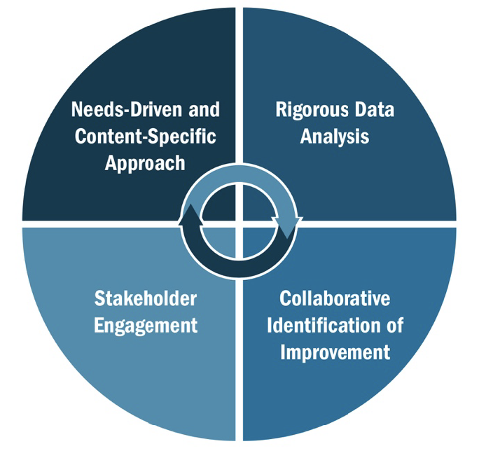
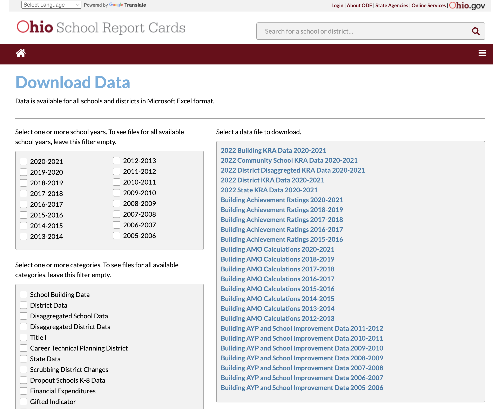
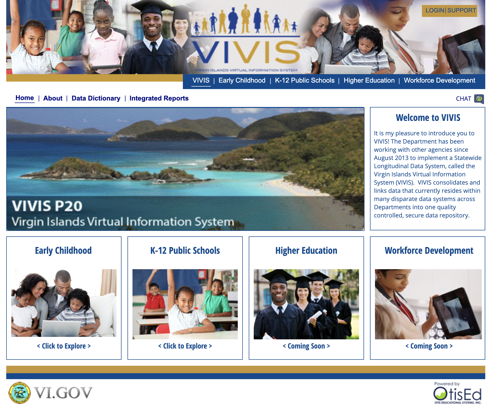
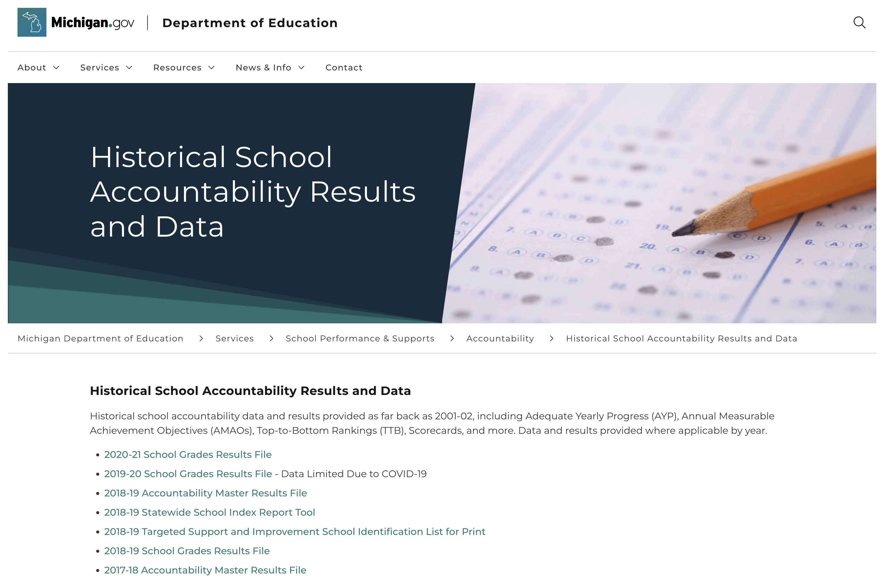
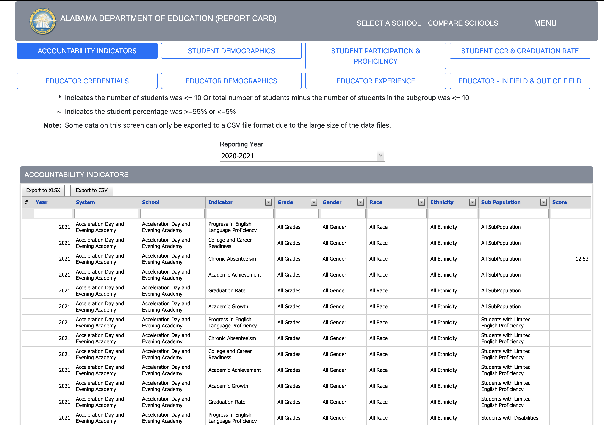
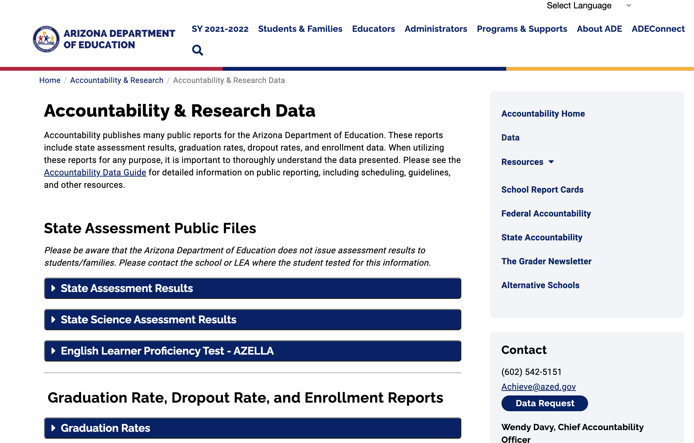
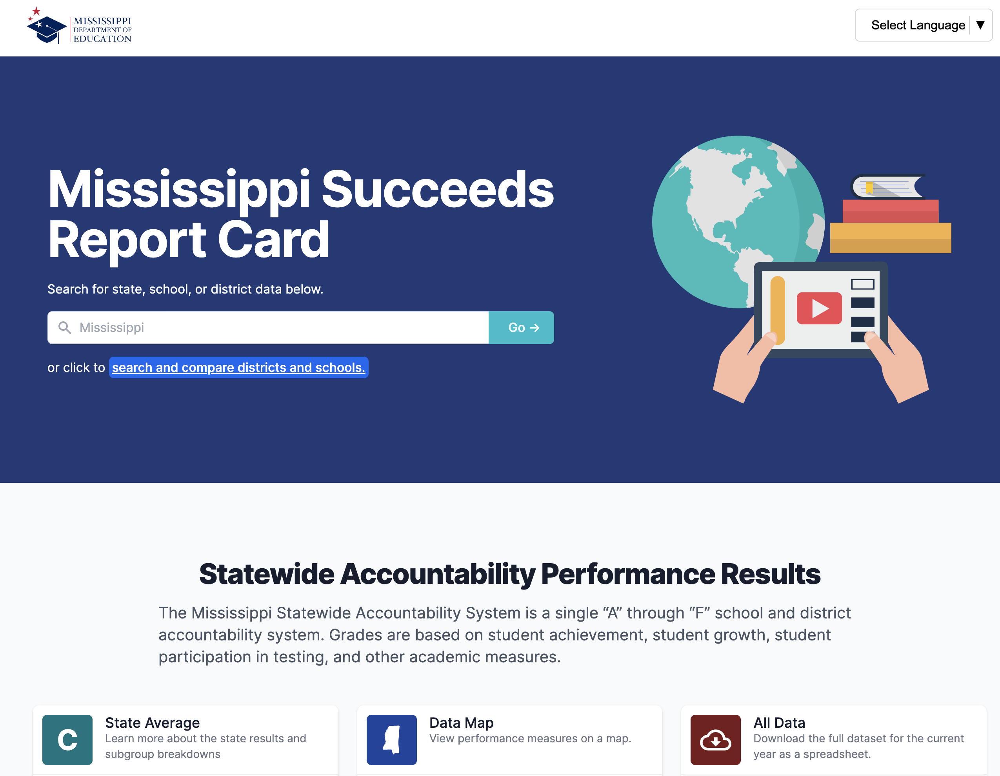
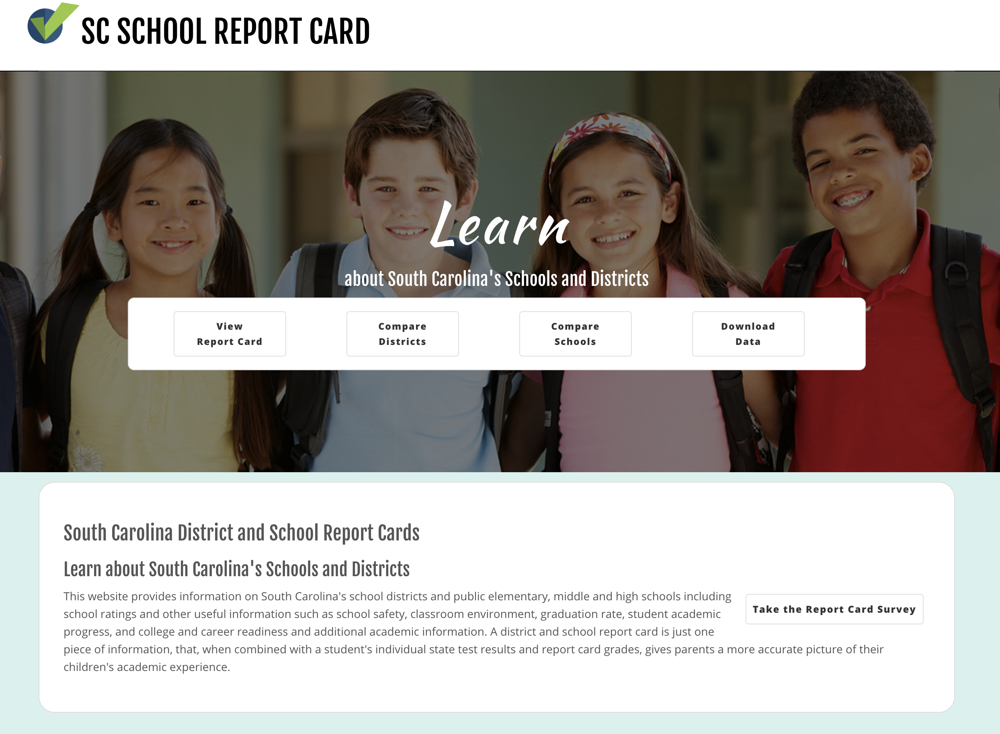

```{r Module01-1, eval = FALSE, echo = FALSE}
# layout: true
  
# <div class="my-header"></div>
# <div class="my-footer"><span>xaringan power    
# &emsp;&emsp;&emsp;&emsp;&emsp;&emsp;&emsp;&emsp;&emsp;&emsp;&emsp;&emsp;&emsp;
# &emsp;&emsp;&emsp;&emsp;&emsp;&emsp;&emsp;&emsp;&emsp;&emsp;&emsp;&emsp;&emsp;
# yolo</span></div> 
# 
# xaringan::inf_mr('/Users/ruhil/Documents/Teaching/Data Analytics/presentations/Module01.Rmd') 
# xaringan::inf_mr('./presentations/Module01.Rmd') 
```

```{r jquery, echo=FALSE}
htmltools::tagList(rmarkdown::html_dependency_jquery())
```

```{r setup, include=FALSE}
options(htmltools.dir.version = FALSE)

knitr::opts_chunk$set(
  fig.align = 'center', echo = FALSE, warning = FALSE, message = FALSE, 
  dpi = 300, cache = TRUE, fig.align = "center", fig.width = 8, 
  fig.height = 6, out.width = "60%", fig.retina = 3
  )

xaringanExtra::use_panelset()

xaringanExtra::use_broadcast()
```

#### .heat[ Agenda ]

.large[
* What data are out there for districts, buildings/schools? 

* If we need to gather student-level data, how can we do that? 2 Examples 

* What might a complete student-level data file look like? 
]

---

#### .heat[Doing a Needs Assessment the right way ...]

.large[Organizations can carry out Needs Assessments in many ways but 3 key steps should be adhered to ...]


---

#### .heat[Ensuring a Needs Assessment is a Success]

.pull-left[
**Four Elements of a Successful Needs Assessment**

```{r, out.width = "75%"}

```

Source: [A Needs Assessment Guidebook](https://oese.ed.gov/files/2020/10/needsassessmentguidebook-508_003.pdf)
]
.pull-right[

**(1) Needs-driven & Context-specific**

* Use an **organizing framework** that defines the problems, topics, and questions to be addressed 

    * One Example: [Four Domains for Rapid School Improvement](http://centeronschoolturnaround.org/wp-content/uploads/2017/02/CST_Four-Domains-Framework-Final.pdf) 
    
    * Another Example: Bake your own organizing framework!  

* Stay anchored to your **local context** 

    * What local factors are causing the problem(s)? 
    
    * What local factors could impede the solution(s)?
]

---

.pull-left[
**Four Elements of a Successful Needs Assessment**

```{r, out.width = "75%"}

```

Source: [A Needs Assessment Guidebook](https://oese.ed.gov/files/2020/10/needsassessmentguidebook-508_003.pdf)
]

.pull-right[
**(2) Rigorous Data Analysis**

* Use multiple sources and types of high quality data (qualitative versus quantitative) 

    * **High Quality:** Data must be gathered via reliable techniques and processes 

* Balance the data you are gathering ...

    * **Input data:** information related to improvement plans, curriculum materials and supplies, training, resource allocation, and intervention programs 
    
    * **Output data:** illustrates outcomes or results and could include student and teacher attendance, student achievement, program reviews, classroom observations, behavior referrals, and so forth 
    
    * **Community Context data:** factors that the district or school likely does not have the power to change but that may affect implementation of interventions 
]


---

.pull-left[
**Four Elements of a Successful Needs Assessment**

```{r, out.width = "75%"}

```

Source: [A Needs Assessment Guidebook](https://oese.ed.gov/files/2020/10/needsassessmentguidebook-508_003.pdf)
]

.pull-right[

**(3) Stakeholder Engagement** 

* Let **local stakeholders** drive the needs assessment, not a few leaders or an outside consultant 

* **Involve** school staff, parents, even students (higher grades of course), local influencers (*but not the Kardashians*), business community 

* Involvement should be in **all aspects and phases** of the needs assessment ... you will get buy-in, their sustained support, and trust in what you are trying to do 
]

---

.pull-left[
**Four Elements of a Successful Needs Assessment**

```{r, out.width = "75%"}

```

Source: [A Needs Assessment Guidebook](https://oese.ed.gov/files/2020/10/needsassessmentguidebook-508_003.pdf)
]

.pull-right[
**(4) Collaborative Identification of Improvement Needs** 

* Needs assessment should lead to a set of **identified needs, prioritized areas of focus** 

* Stakeholder-driven, very **collaborative identification** of improvement needs means everyone sees themselves in the data, increasing ownership and understanding of the process 

* Such a collaborative-approach **shifts mindsets** from a "mutually agreeable" approach to a "mutually beneficial" approach, building a team that recognizes the challenges but wants to move forward as one  

]

---

class: inverse, middle, center

# All about the data now 

---

#### .heat[What types of data would be good to consider?]

.pull-left[
**Four Elements of a Successful Needs Assessment**

```{r, out.width = "75%"}

```

Source: [A Needs Assessment Guidebook](https://oese.ed.gov/files/2020/10/needsassessmentguidebook-508_003.pdf)
]

.pull-right[

**Needs-Driven and Context-Specific Approach**

* .heatinline[Compare data sources] to the guiding questions and overarching topic framework to ensure that all included data respond to the needs assessment purpose and can be triangulated with other data sources. 

* Include .heatinline[data that describe the climate and culture] of the organization and community. 

* If looking at comparison data, consider other school districts and/or communities with .heatinline[similar demographics or organizational structures].


* Identify and consider .heatinline[contextual information needed to understand the data or limitations in the data] to avoid spurious or unrelated inferences about the data

]

---

.pull-left[
**Four Elements of a Successful Needs Assessment**

```{r, out.width = "75%"}

```

Source: [A Needs Assessment Guidebook](https://oese.ed.gov/files/2020/10/needsassessmentguidebook-508_003.pdf)
]

.pull-right[

**Rigorous Data Analysis**

* .heatinline[Disaggregate data wherever possible] to help identify areas of need that otherwise may not be apparent. Consider the following: 
    * Demographics (e.g., race, ethnicity, gender) 
    * Exceptional students (e.g., students with disabilities, gifted students, low-achieving students) 
    * Students with additional needs (e.g., students in foster care; those who are homeless or migratory; and/or those whose families are highly mobile, such as military families)

* .heatinline[Aggregate observation] data by grade level or grade band and perception data by stakeholder group.


* .heatinline[Include longitudinal data (when possible)] to aid in identifying any trends over time.


* .heatinline[Create visuals] (charts, tables, graphs) to help the reader digest information presented.


* .heatinline[Allow for reflection] without assuming cause before data are triangulated across multiple sources.

]

---

.pull-left[
**Four Elements of a Successful Needs Assessment**

```{r, out.width = "75%"}

```

Source: [A Needs Assessment Guidebook](https://oese.ed.gov/files/2020/10/needsassessmentguidebook-508_003.pdf)
]

.pull-right[
**Stakeholder Engagement** 

* .heatinline[Build stakeholders’ capacity to make informed decisions] by engaging them in data collection, defining unfamiliar terminology, avoiding jargon, and ensuring access to necessary background information. 

* .heatinline[Ensure stakeholders understand data] used in the needs assessment, and display data in formats that are easy to interpret and analyze. 

* .heatinline[Encourage authentic engagement] by setting clear expectations for participation, facilitate dialogue rather than presenting information in a lecture-style format, and commit to finding answers collaboratively. 

]

---

.pull-left[
**Four Elements of a Successful Needs Assessment**

```{r, out.width = "75%"}

```

Source: [A Needs Assessment Guidebook](https://oese.ed.gov/files/2020/10/needsassessmentguidebook-508_003.pdf)
]

.pull-right[

**Collaborative Identification of Improvement Needs**

When preparing and organizing data to present, .heatinline[consider all stakeholders who will have a role in Interpreting Information and Prioritizing Needs], as well as the processes that will be used to complete these later steps. 

It is important to ensure that .heatinline[data presentation is clear and accessible] for the intended audience.

]

---

.medium[

Select and use readily available and relevant data sources. Determine additional data needed. Sources to consider include the following: 

* Assessment results, community demographics, student and teacher attendance, and behavior referrals 

* Data from classrooms, after-school programs, and summer programs 

* Surveys, interviews, and/or focus groups to gather perceptions from diverse groups, such as parents, educators, students, and community members 

* Review of relevant district and school policies, plans, and allocation of resources

]

---

#### .heat[If you must gather your own data ...]

.medium[
* Administrative records (maintained by school or district central office)

    * Attendance, discipline, mobility, turnover, student/staff demographics, etc.

* Surveys (you deploy) 

    * Students, staff, parents, stakeholders

* Focus Groups (you deploy)

    * Students, staff, parents, stakeholders

* Assessments of academic performance (you deploy)

    * Short-cycle assessments 
    * Other assessments you devise

]

---

class: inverse, middle, center

# Data Activity (1)

---

#### .heat[Two examples of an intake form] 

.medium[

* Look in your Team’s folder on Scarlet and open Two PDFs ... 

    * An Ohio Example: [An Absenteeism Intervention Team Planning Checklist](https://www.escneo.org/Downloads/Absence%20Intervention%20Team%20and%20Plan%20Template2.pdf) 
    
    * An Illinois Example: [A Student Attendance Intervention Plan](https://www.escneo.org/Downloads/Student%20Attendance%20Intervention%20Plan%20-%20Illinois2.pdf) 

* However you gather whatever data you gather, if it is student-level data, it should be setup something like .heatinline[typical-student-level-data-setup.xlsx] 

]

```{r}
countdown::countdown(minutes = 10, top = 0)
```

---

#### .heat[State Departments of Education Data]

.panelset[

.panel[.panel-name[Ohio]

```{r, out.width = "45%"}

```

[Source: Ohio Department of Education](https://reportcard.education.ohio.gov/download)
]

.panel[.panel-name[US Virgin Islands]

```{r, out.width = "45%"}

```

[Source: US Virgin Islands Department of Education](https://vivisdata.vi.gov/Nimble/asp/Main.aspx?evt=2048001&src=Main.aspx.2048001&documentID=625A3D75454561CD4DF3C280ED296E48&currentViewMedia=1&visMode=0&Server=VIVIS-IS-PRO&Project=VIVIS%20Public&Port=0&connmode=8&ru=1&share=1&hiddensections=header,path,dockTop,dockLeft,footer&valuePromptAnswers=2021)

]

.panel[.panel-name[Michigan]

```{r, out.width = "55%"}

```

[Source: Michigan Department of Education](https://vivisdata.vi.gov/Nimble/asp/Main.aspx?evt=2048001&src=Main.aspx.2048001&documentID=625A3D75454561CD4DF3C280ED296E48&currentViewMedia=1&visMode=0&Server=VIVIS-IS-PRO&Project=VIVIS%20Public&Port=0&connmode=8&ru=1&share=1&hiddensections=header,path,dockTop,dockLeft,footer&valuePromptAnswers=2021)

]

.panel[.panel-name[Alabama]

```{r, out.width = "55%"}

```

[Source: Alabama Department of Education](https://reportcard.alsde.edu/SupportingData_Accountability.aspx)
]

.panel[.panel-name[Arizona]

```{r, out.width = "55%"}

```

[Source: Arizona Department of Education](https://www.azed.gov/accountability-research/data)

]

.panel[.panel-name[Mississippi]

```{r, out.width = "55%"}

```

[Source: Mississippi Department of Education](https://msrc.mdek12.org/)

]

.panel[.panel-name[South Carolina]

```{r, out.width = "50%"}

```

[Source: South Carolina Department of Education](https://screportcards.com/)

]

]

---

#### .heat[Similar (aka "Peer") Districts]

.panelset[

.panel[.panel-name[Ohio]

```{r, out.width = "40%"}
knitr::include_graphics("ohio-similar.png")
```

[Ohio's Approach](https://webapp2.ode.state.oh.us/similar_districts/Similar_Districts.asp)

]

.panel[.panel-name[Michigan]

```{r}
library(tidyverse)

readxl::read_excel(
    "2020-21_School_Grades_Results.xlsx"
    ) %>%
  slice_head(n = 2) -> midf

DT::datatable(midf, options = list(
      scroller = TRUE,
      deferRender = TRUE,
      scrollY = 400
      )
      )

```

**Source:** 2020-21_School_Grades_Results.xlsx
]

]

---

class: inverse, middle, center

# Data Activity (2)

---

.medium[

* Look in your Team folder and you will see two things ... 
    * A folder with your state’s name … containing a few Excel files
    
    * A PDF called **Links to Data provided by your state.pdf**

* Open the PDF ... 
    * There may be more than one link provided 
    
    * The link in red is to a specific page that has hyperlinks to various data
    
    * The other link(s) are to higher-level/main pages for Reports and Data 

* .heatinline[Follow the link in red and explore what data you see there.] Look for your school or district, and then another "peer" school/district. Note what indicators you see collected by the state, which are new to you and which are familiar?

]

```{r}
countdown::countdown(minutes = 20, top = 0)
```

---

class: inverse, middle, center

# .fancy[.salt[Questions??]]


