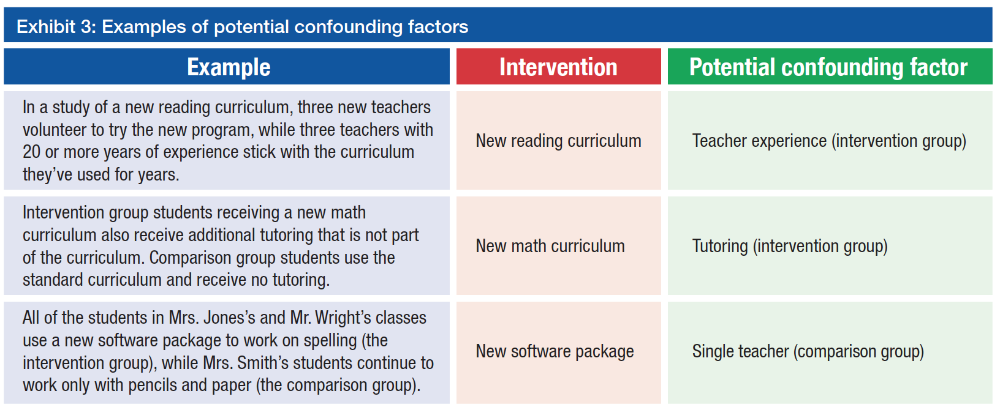
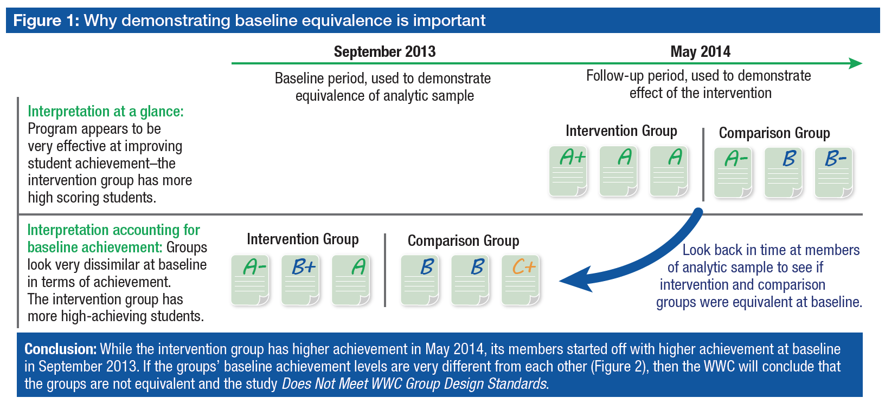
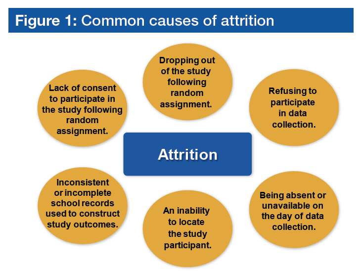
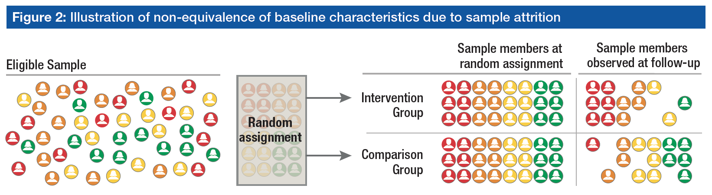

```{r Module01-1, eval = FALSE, echo = FALSE}
# layout: true
  
# <div class="my-header"></div>
# <div class="my-footer"><span>xaringan power    
# &emsp;&emsp;&emsp;&emsp;&emsp;&emsp;&emsp;&emsp;&emsp;&emsp;&emsp;&emsp;&emsp;
# &emsp;&emsp;&emsp;&emsp;&emsp;&emsp;&emsp;&emsp;&emsp;&emsp;&emsp;&emsp;&emsp;
# yolo</span></div> 
# 
# xaringan::inf_mr('/Users/ruhil/Documents/Teaching/Data Analytics/presentations/Module01.Rmd') 
# xaringan::inf_mr('./presentations/Module01.Rmd') 
```

```{r jquery, echo=FALSE}
htmltools::tagList(rmarkdown::html_dependency_jquery())
```

```{r setup, include=FALSE}
options(htmltools.dir.version = FALSE)

knitr::opts_chunk$set(
  fig.align = 'center', echo = FALSE, warning = FALSE, message = FALSE, 
  dpi = 300, cache = TRUE, fig.align = "center", fig.width = 8, 
  fig.height = 6, out.width = "60%", fig.retina = 3
  )

xaringanExtra::use_panelset()

xaringanExtra::use_broadcast()

```

#### .heat[ Agenda ]

.medium[
* The "Typical" student ... no Heffalump for sure!  

* Visualize, visualize, visualize 

* Crazy little thing called _Confounding_ 

* _Equivalence_, _Attrition_, & _Bias_ 
]

---

#### .heat[Typical: The Mean]  

.medium[ 
* Numeric data used ... test scores, number of days absent, number of disciplinary incidents, and so on 

* Question of interest: How did the "average", the "typical" student do?  

* Default answer will be from calculating the Mean ... add all students' scores, divide by the number of students, and voila!  

    * Example: 7 students’ scores on 10-point quiz: 1, 5, 6, 7, 7, 10, 10 
    
    * Mean = `r round(sum(1, 5, 6, 7, 7, 10, 10) / 7, digits = 1)`

]

---

#### .heat[Typical: The Median]

.medium[ 
* Mean intuitive, extensively used, but influenced by a few extreme scores ... notice that 4 out of 7 students scored 7 or higher but the "average" is **< 7**, because of the student who scored **1** 

* In these situations the Median better represents the "average", the "typical" score 

* Calculated by lining up the scores in ascending or descending order and finding the mid-point 
    * Example: 7 students’ scores on 10-point quiz: 1, 5, 6, 7, 7, 10, 10 
    * Midpoint is highlighted: 1, 5, 6, **[7]**, 7, 10, 10 
    * Notice how the "average" now is 7 

]

---

#### .heat[Typical: The Mode]

.medium[
* Designed for non-numeric data (Gifted, LEP, FRL, Gender, etc) 

* Most intuitive of the three because people understand “the typical student is a Gifted student”, “the typical student in our district is rated Above Proficient on the 3rd Grade ELA assessment”, etc. 

* You can flip numeric data into non-numeric data by grouping numeric data 
]

---

```{r, echo=FALSE}
readxl::read_excel("cutscores01.xlsx", sheet = 1) -> tab01
readxl::read_excel("cutscores01.xlsx", sheet = 2) -> tab02
```

.panelset[

.panel[.panel-name[Example-01]

```{r, echo=FALSE}
knitr::kable(tab01, booktabs = TRUE, caption = "Scale Score Ranges in English Language Arts, 2017-18") |>
  kableExtra::kable_styling("striped")
```
]

.panel[.panel-name[Example-02]
```{r, echo=FALSE}
knitr::kable(tab02, booktabs = TRUE, caption = "Third Grade Reading Guarantee Performance Level Scale Score Ranges, 2017-18") |> 
  kableExtra::kable_styling("striped")
```
]

]

---

#### .heat[Don't forget variability!]

```{r, out.width="50%"}
library(data.table)
library(ggplot2)

set.seed(123)
dat_data <- data.table(meanval = rnorm(10),
                       sdval = runif(10, 0.5, 3),
                       rep = sample.int(1000, 10)
                       )

dat <- rbindlist(lapply(1:dim(dat_data)[1], 
                        function(x) data.table(rowval = x, 
                                               dist = rnorm(dat_data[x, rep], 
                                                            dat_data[x, meanval], 
                                                            dat_data[x, sdval])))
                 )

ggplot(dat, aes(x = dist, fill = factor(rowval))) +
  geom_density(alpha = 0.3) + 
  theme_void() + 
  theme(legend.position = "hide")

```

#### Range = (Maximum - Minimum) a useful rough measure of variability

---

#### .heat[.medium[Always look at your data!!]]

.panelset[

```{r}
library(datasauRus)
library(tidyverse)
```

.panel[.panel-name[`How things look`]

```{r}
datasaurus_dozen %>% 
    group_by(dataset) %>%
    summarize(
      `Mean of x` = mean(x),
      `Mean of y` = mean(y),
      `Variation of x` = sd(x),
      `Variation of x` = sd(y)
    ) %>%
  knitr::kable(., booktabs = TRUE, digits = c(0, 1, 1, 1, 1)) %>%
  kableExtra::kable_styling("striped", font_size = 14)
```
]

.panel[.panel-name[`How things really are`]

```{r, out.width="50%"}
ggplot(datasaurus_dozen, aes(x = x, y = y))+
  geom_point() +
  theme_void() +
  theme(legend.position = "none") +
  facet_wrap(~dataset, ncol = 7)
```

]

.panel[.panel-name[`The Datasaurus`]

```{r, out.width="50%"}
datasaurus_dozen %>%
  filter(dataset == "dino") %>%
  ggplot(aes(x = x, y = y))+
  geom_point() +
  theme_void() +
  theme(legend.position = "none") 
```

]

]

---

#### .heat[Confounding]

<center></center>
<center>Image Source: Quality Matters</center>

---

#### .heat[Confounding commonly seen by WWC reviewers ...]

```{r, out.width = "100%"}

```
Source: [What Works Clearinghouse Standards Brief: Confounding](https://ies.ed.gov/ncee/wwc/Docs/referenceresources/wwc_brief_confounds_101117.pdf) 

---

#### .heat[Baseline Equivalence]

.medium[
* When two groups are similar at the start of a study (baseline) and, after that, the only difference between the groups is that one receives the intervention and the other does not, it is reasonable to conclude that any differences in the outcomes that are measured at the end of a study (follow-up) are caused by the intervention. 

* However, if the two groups are __different at baseline on key characteristics that could influence the outcomes__, the effect found at the end of the study might be due to the differences that already existed at the beginning. 

* Demonstrating baseline equivalence is important in studies that did not assign participants randomly to the intervention and comparison groups. 

* It is also important in **random assignment** studies with high **attrition**.

]

---

```{r, out.width = "100%"}

```
Source: [What Works Clearinghouse Standards Brief: Baseline Equivalence](https://ies.ed.gov/ncee/wwc/Docs/referenceresources/wwc_brief_baseline_080715.pdf) 

---

#### .heat[Attrition: Losing participants over time]

.panelset[
.panel[.panel-name[`Sources of Attrition`]

```{r, out.width = "50%"}

```
Source: [What Works Clearinghouse Standards Brief: Attrition](https://ies.ed.gov/ncee/wwc/docs/referenceresources/wwc_brief_attrition_080715.pdf)

]

.panel[.panel-name[`Potential Consequences of Attrition`]

```{r, out.width = "100%"}

```
Source: [What Works Clearinghouse Standards Brief: Attrition](https://ies.ed.gov/ncee/wwc/docs/referenceresources/wwc_brief_attrition_080715.pdf)

]

.panel[.panel-name[`Potential Bias`]

.medium[Bias .. the difference between 

* the impact estimated using data from a sample experiencing attrition 

... .heatinline[versus] ... 

* the true impact that would have been estimated had there been no attrition]

]

]

---

class: inverse, middle, center

# .fancy[.salt[Questions??]]


